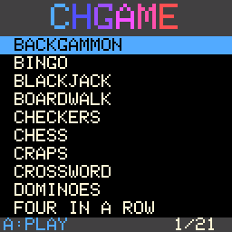

# CHCasino

Twenty casino and table games for the **CHGame** handheld, together with
everything needed to build, test and run them: the Arduino board package,
the graphics and SD-card libraries, a PC simulator, and the hardware docs.
With only this repository you can set up the toolchain, build any game, play
it in the simulator, and upload it to a board.

CHGame is a low-cost open colour handheld: a **WCH CH32X035** RISC-V
microcontroller (48 MHz, 62 KB flash, 20 KB SRAM), a **128x128 ST7735S**
colour LCD, a **microSD** slot on the same SPI bus as the screen, eight
buttons, a piezo speaker, a status LED and **USB-C**. It uploads over USB
with no button presses, like an Arduino Leonardo.

The games share one look: a casino of green felt, gold lettering, casino
chips and a dealer. They all fit on one SD card behind the **game menu built
into the bootloader**: switch on, pick a game, play, with no PC, like an
Arduboy FX ([docs/sd-menu.md](docs/sd-menu.md)). Each game is still its own
Arduino sketch, uploaded as usual during development.



> **For AI agents and new developers:** read [CLAUDE.md](CLAUDE.md) first.
> It has the build, simulator and test commands, the rules of the codebase,
> and the hardware limits.

## The games

Each game is a standalone sketch in `games/<Name>/<Name>.ino` with its own
README (rules, controls, design) and NOTES.md (status, design decisions,
open items). The image column is the release build size, against the
**50,944 B** the bootloader leaves for a sketch.

| Game | What it is | Image |
|---|---|---|
| [CHBackgammon](games/CHBackgammon) | Backgammon on felt with chip checkers, a trained CPU, optional match play and doubling cube | 49,524 B |
| [CHBingo](games/CHBingo) | 75-ball bingo: up to nine cards against a hall of rivals, power-ups and a jackpot | 36,724 B |
| [CHBlackjack](games/CHBlackjack) | Press Play On Tape's Arduboy Blackjack rebuilt in colour: the series' first table | 45,812 B |
| [CHBoardwalk](games/CHBoardwalk) | BOARDWALK, a property-trading board game on an isometric board, with tap auctions | 49,856 B |
| [CHCheckers](games/CHCheckers) | Checkers on CHChess's isometric board, with its own engine and chip pieces | 42,024 B |
| [CHChess](games/CHChess) | Isometric chess with a pointing glove, whip-zoom camera and a CPU of three strengths | 48,884 B |
| [CHCraps](games/CHCraps) | Casino craps with 3D dice and Blackjack's dealer as the stickman | 50,032 B |
| [CHCrossword](games/CHCrossword) | 13x13 crosswords, built in and as packs on the SD card | 50,300 B |
| [CHDominoes](games/CHDominoes) | Dominoes (ALL FIVES and DRAW) with bevelled tiles and a close-up camera | 42,356 B |
| [CHFour](games/CHFour) | FOUR IN A ROW, against the dealer as a friendly coach | 36,332 B |
| [CHMahjong](games/CHMahjong) | Mahjong solitaire with the 144 traditional tiles and a close-up view | 48,364 B |
| [CHPoker](games/CHPoker) | Poker against three CPU players: Hold'em, Five Card Draw, Omaha and Seven Card Stud | 48,908 B |
| [CHRoulette](games/CHRoulette) | Roulette with a physically simulated ball and the dealer as croupier | 49,796 B |
| [CHSlots](games/CHSlots) | Three slot machines on one purse: LUCKY 7, SWEET and DRAGON FORTUNE | 47,112 B |
| [CHSnakes](games/CHSnakes) | SNAKES & LADDERS with procedural snakes, CLASSIC and ARCADE rules | 37,336 B |
| [CHSolitaire](games/CHSolitaire) | Klondike, after the Windows original | 31,144 B |
| [CHTicTacToe](games/CHTicTacToe) | TIC TAC TOE: ROYALE, sixteen tables on 3x3 and 5x5 boards, for money | 50,308 B |
| [CHWords](games/CHWords) | A crossword tile game (Scrabble rules) with a flash dictionary and a full one on SD | 50,396 B |
| [CHWordWheel](games/CHWordWheel) | WORD WHEEL, a word-puzzle game show: spin, call letters, solve | 50,312 B |
| [CHYacht](games/CHYacht) | YACHT DICE (five dice, thirteen boxes) with Craps's 3D dice | 43,732 B |

[docs/status.md](docs/status.md) lists what each game has been verified on
(the simulator or the device), its open items and the known issues.

## Repository map

```
CHCasino/
├── CLAUDE.md          start here: commands, rules, limits, gotchas
├── games/             the 20 games, one Arduino sketch each
├── utilities/         helper sketches (CHSDtoUSB: the SD card as a USB drive)
├── platform/          everything a build needs, vendored at a known version
│   ├── bootloader/      the bootloader with the SD game menu: sources, PC test suite, binaries
│   ├── board/           the CHGame Arduino board package (core, variant, bootloader) + its docs
│   ├── libraries/CHGfx/ the graphics library
│   ├── libraries/CHSd/  the read-only SD/FAT library (source of the games' src/sd copies)
│   └── hardware/        Rev 0 schematic and netlist
├── tools/             PLATFORM-WIDE tools shared by every game (the PC simulator, size report, serial,
│                      chgpack.py for game packages, sdcard/mkcard.py for the whole card)
└── docs/              platform knowledge: hardware, performance, SD card, how a game is built, status
```

## Quick start

You need `arduino-cli` (or the Arduino IDE 2.x), Python 3.9+ and, for the
simulator and host tests, a C++ compiler. zig is the easiest; it comes with
pip.

```bash
# 1. The board package (toolchain and uploader come with it)
arduino-cli config add board_manager.additional_urls https://github.com/bateske/CH32SerialBoot/releases/latest/download/package_chgame_index.json
arduino-cli core update-index
arduino-cli core install CHGame:ch32v@0.2.4

# 2. Python tools and a compiler for the simulator
pip install -r tools/requirements.txt ziglang

# 3. Build a game (from its folder) against CHCasino's own CHGfx
cd games/CHFour
python tools/device.py build              # release build + size report
python tools/check.py --no-device         # host tests + every sim script, twice (games that have check.py)
python ../../tools/chsim/chsim.py build . # just the PC simulator
python tools/chsim/chdrive.py --sim . tools/scripts/endings.txt out/endings   # screenshots in out/endings

# 4. On a board (plugged in by USB)
python tools/device.py upload

# 5. A card for the game menu: builds and packs every game into out/sdcard/
cd ../..
python tools/sdcard/mkcard.py             # copy out/sdcard/* to a FAT32 card
```

The Arduino IDE also works: install the board package from the Boards
Manager URL above, copy `platform/libraries/CHGfx` into your sketchbook's
`libraries/` folder, open `games/<Name>/<Name>.ino`, and set *Tools >
Optimize* to **Smallest + LTO** and *Tools > USB* to **Upload only**.

## The common libraries

Every game is built from the same four layers. They are all in this
repository at the versions the games were built and checked with.

### 1. The CHGame board package: `platform/board/`

This is the Arduino core for the board: package `CHGame`, architecture
`ch32v`, version **0.2.4**, from
[CH32SerialBoot](https://github.com/bateske/CH32SerialBoot). It is a fork of
the WCH CH32 Arduino core. It adds the CHGame variant (pin names such as
`PIN_BTN_A` and `PIN_SD_CS`), the USB CDC serial port, the app linker
script (the sketch starts at 0x3000, above the 12 KB bootloader), and the
`chgame-upload` tool, which uploads over USB in about half a second with no
button presses. Install it through the Boards Manager URL. The copy here is
for reading and for offline reference.

Its Tools menus matter for every game:

| Menu (FQBN key) | Games use | What it does |
|---|---|---|
| Optimize (`opt`) | `oslto` | `-Os -flto`. Usually 1-5 KB smaller than plain `-Os`; several games only fit with it. |
| Peripherals (`periph`) | `game` (default) | Compiles out Serial1, `tone()`, PWM and HardwareTimer: about 4 KB. |
| USB (`usb`) | `uploadonly` for release | Drops `Serial` (about 0.7 KB). Upload still works with no button presses. Debug builds keep `serial`. |
| C library (`rtlib`) | `nano` (default) | newlib-nano |

Release FQBN: `CHGame:ch32v:CHGame:opt=oslto,rtlib=nano,periph=game,usb=uploadonly`.

### 2. CHGfx: `platform/libraries/CHGfx/`

The graphics library, version **1.3.0**, from
[bateske/CHGfx](https://github.com/bateske/CHGfx). A full 16-bit
framebuffer would not fit in 20 KB of RAM. CHGfx keeps a **4-bit indexed
framebuffer** (8 KB, a 16-colour palette that can change every frame),
converts it to the panel's format in chunks, and streams it out by DMA at
24 MHz while the game draws the next frame. It provides the drawing
primitives, sprites (`sprite4`), fonts, text effects, palette effects and
partial updates. It also owns the SPI bus that the SD card shares.
[docs/performance.md](docs/performance.md) explains the design and its
measured limits.

### 3. CHSd: `platform/libraries/CHSd/`

A small read-only SD library: a polled SPI block driver plus a FAT16/FAT32
reader, about 1.7 KB of flash and 24 B of RAM. CHWords, CHCrossword and
CHWordWheel use it to read their dictionary, puzzle packs and phrase bank
from the card. A sketch can only compile what is in its own folder, so each
of those games carries a **generated copy** in `src/sd/`. Edit CHSd here and
regenerate the copies with its `tools/vendor.py`; never edit a game's copy
(see CLAUDE.md). CHSDtoUSB has its own faster, read-write SD driver, which
is GPL-3.0 and stays inside that sketch.

### 4. The shared in-game modules (copied into each game)

The games grew from one another, so each carries the same small core in its
own `src/`, often adapted (see [docs/game-anatomy.md](docs/game-anatomy.md)):
- `CHGame.h/.cpp`: buttons, frame pacing and lockstep, identical in every game.
- `RamFunc.h`: puts hot code in SRAM.
- `debug/`: the serial debug protocol for screenshots, injected input and
  lockstep frames. It is how the simulator and `chdrive.py` drive a game.
- `save/`: settings and saved games in two flash pages past the end of the
  image. There is no EEPROM.
- `audio/`: sound effects and tunes on the piezo.
- `gfx/`, `fx/`, `stage/`: the house style of fonts, masks, palette
  effects, banners and particles.

### The shared tools: `tools/`

**Platform-wide** tools, used by every game:
- the **PC simulator** (`tools/chsim`): it compiles a game's real code with
  CHGfx's real drawing code for the PC, runs it deterministically, and
  produces screenshots and GIFs;
- the flash/RAM **size report** (`check_size.py`);
- the USB **serial** helper (`serialcap.py`);
- the **game package** tool (`chgpack.py`): wraps any sketch's `.bin` as a
  `.CHG` for the SD menu, checks packages, lists a card;
- the **card builder** (`sdcard/mkcard.py`): builds every game and lays out
  a whole card.

### The bootloader and the SD game menu: `platform/bootloader/`

The board's permanent bootloader (12 KB at 0x0000), from CH32SerialBoot
0.2.4, with a game menu added:
- the menu appears at every power-on and lists `GAMES/*.CHG` from a
  FAT16/FAT32 card;
- the installed game is preselected, and starting it writes nothing;
- holding START for 3 s in any game goes back to the menu;
- another game is checked completely before anything is erased;
- USB uploading, recovery and the memory map are unchanged.

It has its own PC test suite, which runs the real C code against models of
the flash, SD card and panel, including a power cut at every flash
operation of an install. Its README covers building, testing and installing
it; [docs/sd-menu.md](docs/sd-menu.md) is the players' guide and
[docs/chg-format.md](docs/chg-format.md) the developers' one-pager.

Tools that each game has adapted stay with the game: the script driver
`chdrive.py`, `device.py`, `check.py`, the tests, the audio preview and the
asset pipeline. [tools/README.md](tools/README.md) classifies every tool in
the repository.

## Licences

Each folder carries its own licence:

| Path | Licence |
|---|---|
| `games/*` | Apache-2.0 (see each game's `LICENSE` and `NOTICE`). CHChess's engine `src/engine/ch2k.hpp` is MPL-2.0. |
| `tools/` | Apache-2.0 (`tools/LICENSE`, `tools/NOTICE`) |
| `platform/board/` | MIT (`platform/board/LICENSE`, `THIRD-PARTY.md`) |
| `platform/bootloader/` | MIT (`LICENSE`, `THIRD-PARTY.md`, `NOTICE`: its 5x7 font is Adafruit glcdfont, BSD) |
| `platform/libraries/CHGfx/` | MIT; some fonts carry their own notices (in its `LICENSE`, e.g. the 3x5 font is Apache-2.0) |
| `platform/libraries/CHSd/` | MIT |
| `utilities/CHSDtoUSB/` | GPL-3.0 (its SD layer comes from sdfatlib) |
| `docs/`, root files | Apache-2.0, like the games |

## Where this came from

On 2026-10-01 each game was copied from the head of its own repository at
`github.com/bateske/<Name>` with no history (the commits are listed in
[docs/status.md](docs/status.md)). The platform pieces come from
CH32SerialBoot `v0.2.4`, CHGfx `1.3.0` and CHSd 1.0.0. Development continues
here. The games may be split back into their own repositories later.
